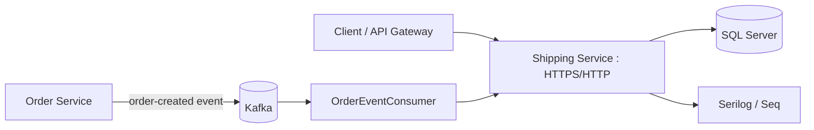

# Shipping Service

Shipping microservice for the commerce platform. It manages shipment records and tracking information through a .NET 10 ASP.NET Core Web API, persists data with Entity Framework Core and SQL Server, and consumes order-created events from Kafka to integrate shipment creation with the order workflow.

## Responsibilities

- Create, read, update and delete shipments.
- Track shipment status and tracking events.
- Persist shipping data in SQL Server.
- Consume order events from Kafka.
- Validate shipment requests.
- Map API/domain objects with Mapperly.
- Expose OpenAPI/Scalar documentation in development.
- Provide structured logging through Serilog.

## System Design



### Event-driven shipment flow

1. Order Service publishes an order-created event to Kafka.
2. `OrderEventConsumer` consumes the event in the Shipping Service.
3. The consumer translates the order event into shipment data.
4. Shipment business logic persists the shipment and tracking information.
5. Clients can query or update shipment status through the REST API.

## Technology Stack

- .NET 10
- ASP.NET Core Web API
- Entity Framework Core 10
- SQL Server
- Confluent.Kafka
- FluentValidation
- Riok.Mapperly
- YARP Reverse Proxy package
- Scalar OpenAPI UI
- Serilog
- Seq sink

The project file defines these dependencies. fileciteturn18file0L2-L2

## Project Structure

```text
shipping-service/
├── Controllers/
│   └── ShipmentsController.cs       # REST endpoints
├── DTOs/
│   ├── Request/                      # API request models
│   └── Response/                     # API response models
├── Data/
│   └── AppDbContext.cs               # EF Core DbContext
├── Exception/                        # Exception handling/types
├── Kafka/                            # Kafka events and consumer
├── Mapper/                           # Mapperly mappings
├── Migrations/                       # EF Core database migrations
├── Models/                           # Shipment and tracking entities
├── Services/
│   ├── IShipmentService.cs
│   └── ShipmentService.cs
├── Validators/                       # FluentValidation rules
├── Program.cs                        # Dependency injection + HTTP pipeline
├── appsettings.json                  # Configuration
├── appsettings.Development.json
├── shipping-service-backend.csproj
└── README.md
```

The repository currently contains dedicated Controllers, DTOs, Data, Kafka, Mapper, Migrations, Models, Services and Validators folders. fileciteturn11file0L2-L2

## REST API

Base route:

```text
/api/Shipments
```

Current controller operations:

| Method | Endpoint | Purpose |
|---|---|---|
| GET | `/api/Shipments?page=0&size=20` | Get paginated shipments |
| GET | `/api/Shipments/{id}` | Get shipment by ID |
| POST | `/api/Shipments` | Create shipment |
| PUT | `/api/Shipments/{shipmentId}` | Update shipment status/details |
| DELETE | `/api/Shipments/{id}` | Delete shipment |

The controller defines these routes and delegates business logic to `IShipmentService`. fileciteturn20file0L2-L2

## Database

Entity Framework Core is configured through `AppDbContext` and the `DefaultConnection` connection string. Database changes are maintained under `Migrations/`.

## Kafka

Kafka integration is implemented under `Kafka/`. The shipping service contains a hosted `OrderEventConsumer`, registered during application startup. fileciteturn19file0L2-L2

The event contract should remain compatible with the event published by Order Service. In particular, field names and serialization format need to be coordinated between producer and consumer.

## Validation and Mapping

- FluentValidation handles request validation.
- Mapperly provides source-generated object mapping.
- Services contain business operations so controllers remain focused on HTTP concerns.

## Observability

Serilog is configured as the application logging provider and request logging is enabled with `UseSerilogRequestLogging()`. fileciteturn19file0L2-L2

## API Documentation

When running in Development, the application maps OpenAPI and Scalar API reference endpoints. fileciteturn19file0L2-L2

## Local Development

### Prerequisites

- .NET 10 SDK
- SQL Server / LocalDB or configured SQL Server instance
- Kafka
- Visual Studio or `dotnet` CLI

### Run

```bash
dotnet restore
dotnet build
dotnet run
```

The repository's sample `.http` file currently references `http://localhost:5184` as its development host. fileciteturn25file0L2-L2

## Architecture Notes

- Shipping owns shipment persistence and tracking data.
- Kafka provides asynchronous integration with the order workflow.
- REST is used for synchronous client access.
- The controller → service → data-access separation keeps HTTP concerns outside business logic.
- For production, consider idempotent event handling, dead-letter handling and explicit retry strategy for Kafka processing.
